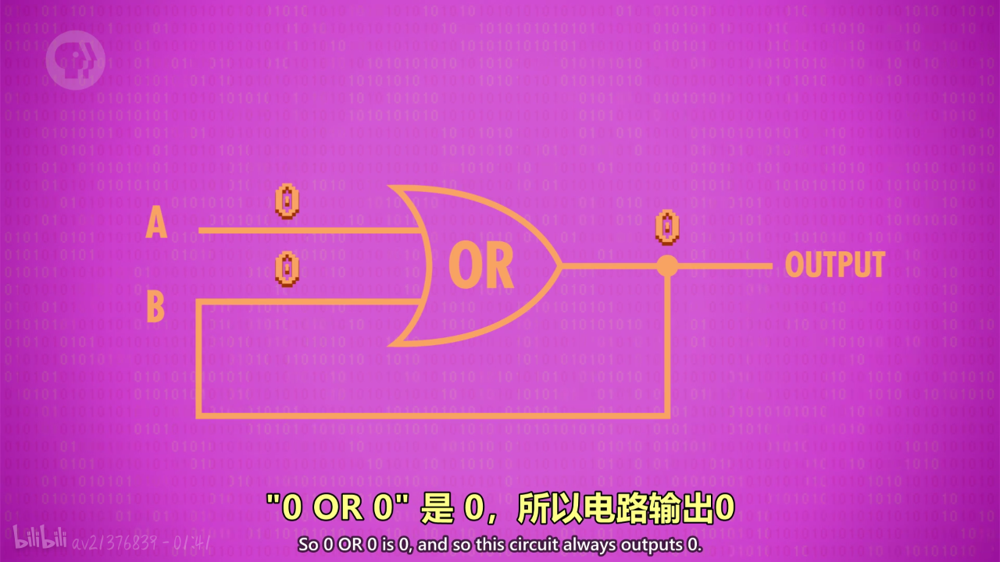
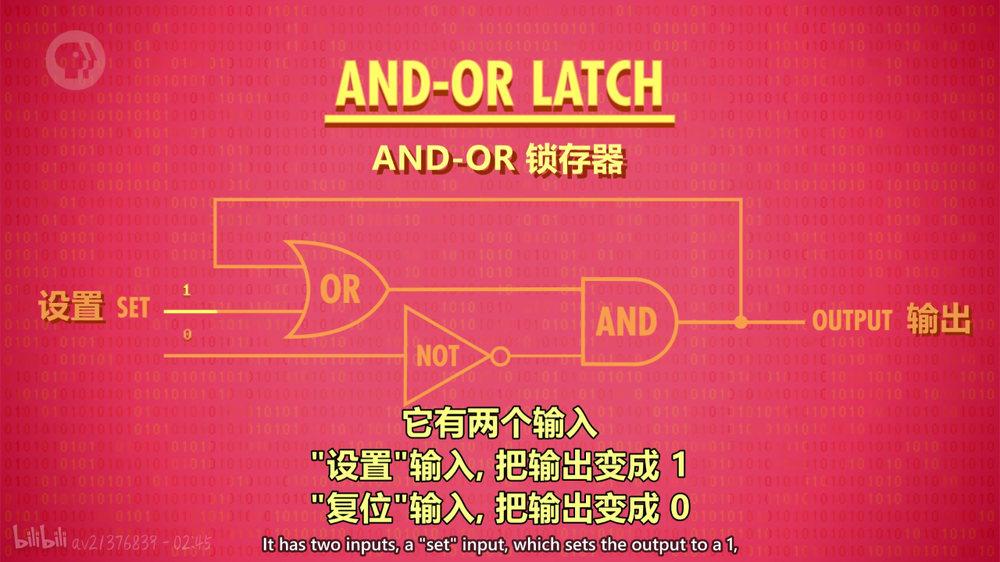
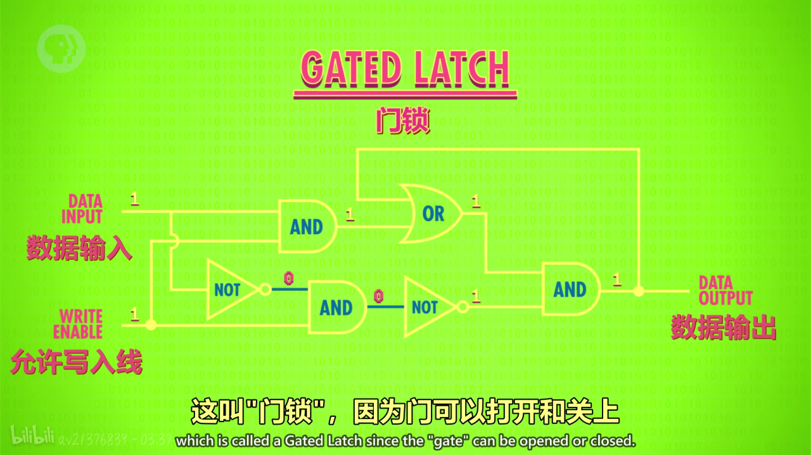
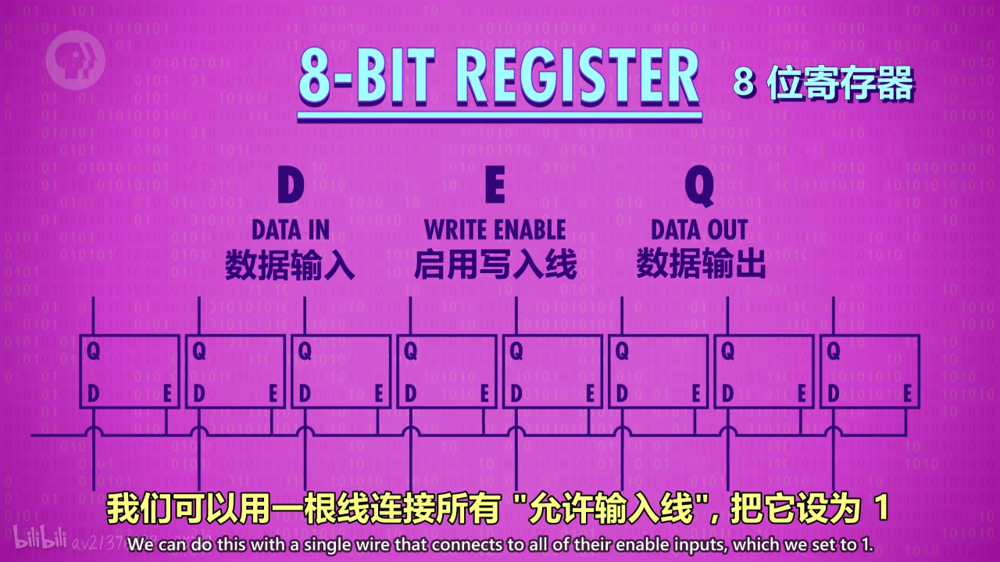
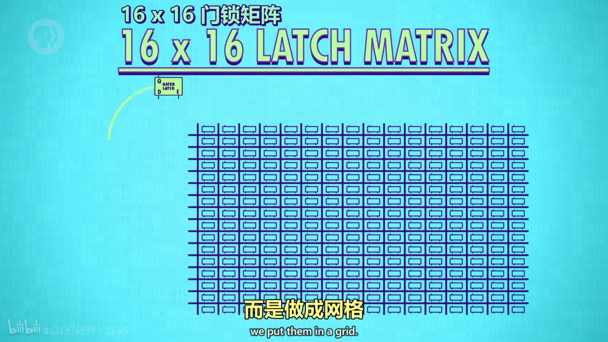
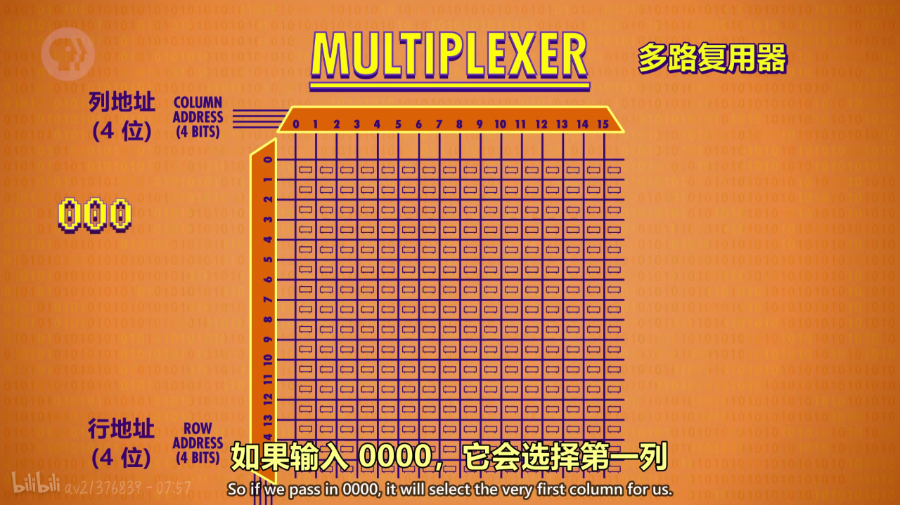

#### 本集要点

* 随机存取存储器(RAM)只能在通电的情况下储存东西，比如游戏状态
* 持久储存即使断电也不会丢失数据

##### 可以记录1的电路

##### 可以记录0的电路

##### AND-OR 锁存器

> 它有两个输入，一个是"设置"输入，可以把输出变成 1；另一个是"复位"输入，可以把输出变成 0。如果"设置"和"复位"都是 0，电路会输出最后放入的内容。也就是说，它存住了 1 位的信息！这叫**锁存**, 因为它"锁定"了一个值。

* 放入数据的动作叫 "写入"  ，拿出数据的动作叫 "读取"
* 启用时允许写入，没启用时就 "锁定"的线叫**允许写入线**

##### 门锁

> 允许写入线打开这允许数据写入，当这条线关闭，数据就无法在改变，这样就保存了1bit的数据

##### 8位寄存器

> 多个锁存器结合起来就组成了一个寄存器，寄存器能存一个数字，这个数字有多少位则称为**位宽**

> 对于八位寄存器，用一根线链接所有所有输入线，然后用八条数据线连接数据输入线，八条数据线发数据，然后将允许输入线设为零，这样一个八位的值就储存起来了

>早期电脑用 8 位寄存器，然后是 16 位，32 位。如今许多计算机都有 64 位宽的寄存器。

##### 16X16门锁矩阵

**单个放大图**

> 以上是门锁矩阵的一个小方格放大的部分，对于以上电路，只有当行列线路都通电时才可以实现存取数据，这样就实现了精确控制某个方格存取数据。同时当READ ENABLE线变为1时就实现了读取数据

##### 多路复用器

> 多路复用器用来指定整个门锁矩阵某个小方格的行线和列线通电，列地址控制列线，行地址控制行线。如果想让第12（1100）行第8（1000）列通电，则需要把12和8转换成二进制数据即11001000。如果输入为0000因为十进制代表零，则列线的第零条线会通电，输入为0001则第一条线通电，以此类推

##### 256位内存

> 256位内存包括八条地址线，一条允许写入线，一条允许读取线，一条数据线，八位地址线接收一个八位地址，4位代表列，4位代表行

* 现代计算机的内存扩展到上兆字节（MB）和千兆字节（GB）的方式就是不断把内存打包到更大规模
> 随着内存地址增多，内存地址也必须增长。8 位最多能代表 256 个内存地址，要给千兆或十亿字节的内存寻址，需要 32 位的地址。

* 内存的一个重要特性是：可以随时访问任何位置，因此叫 "随机存取存储器" ，简称 RAM。
> RAM 就像人类的短期记忆，记录当前在做什么事

> 还有其他类型的 RAM，如 DRAM，闪存和 NVRAM。它们在功能上与 SRAM 相似，但用不同的电路存单个位，但根本上  这些技术都是矩阵层层嵌套，来存储大量信息。就像计算机中的很多事情，底层其实都很简单，**让人难以理解的，是一层层精妙的抽象**
